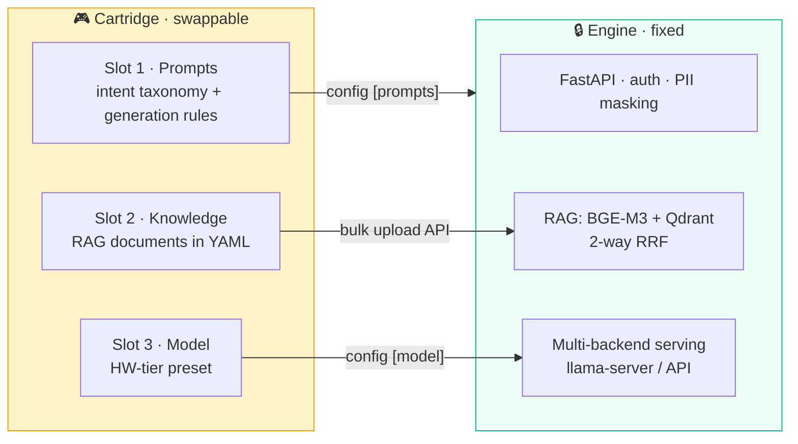
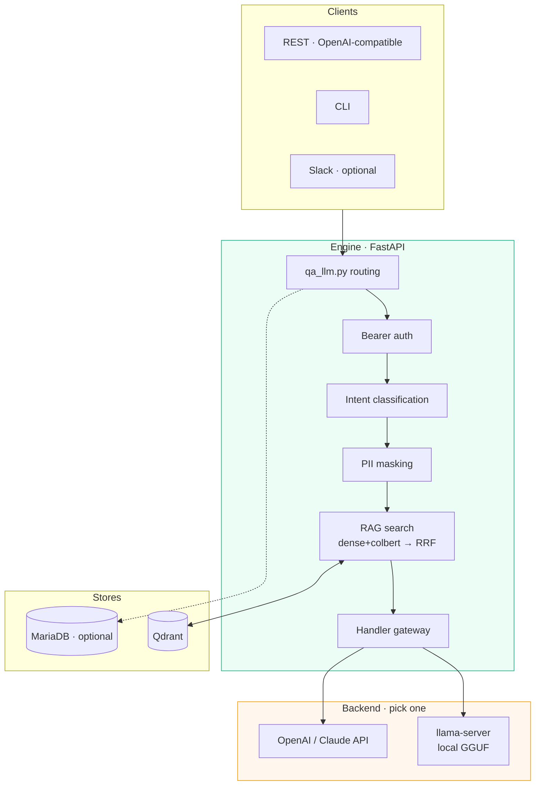

<div align="center">

# 🕹️ ai-console

### Build your own self-hosted AI agent — the engine is fixed, the domain is a cartridge

**A general-purpose on-premise AI agent console, distilled from a production SecOps agent.
The engine — RAG, intent routing, multi-backend model serving — stays fixed.
Your domain — prompts, knowledge, model — plugs in as a cartridge.**

[](https://python.org)
[](https://fastapi.tiangolo.com)
[](https://github.com/ggml-org/llama.cpp)
[](https://qdrant.tech)
[](https://huggingface.co/BAAI/bge-m3)
[](LICENSE)


**[🇰🇷 한국어 README](README.md)**

</div>

---

## Why ai-console

- **Production lineage, not a demo.** Forked from a SecOps monitoring agent running in real operations (Gemma-4-26B · ~4,000 vectors in Qdrant · RTX 5090). The architecture was proven first; this repo only generalizes it.
- **No framework lock-in.** Plain FastAPI + llama.cpp + Qdrant. No LangChain, no orchestration layer to learn or fight.
- **No fine-tuning.** Domain capability comes entirely from prompts + RAG on stock model weights. Swapping domains never touches the model.
- **Runs on your hardware.** Model presets from CPU-only machines to 32GB+ GPUs — or API backends (OpenAI / Claude) when on-prem isn't a requirement.

---

## 🚀 Quick start

```bash
git clone https://github.com/adorahelen/ai-console-public.git ai-console && cd ai-console
./install.sh          # detects your HW → picks a tier → suggests a preset → installs everything
```

The installer detects VRAM/RAM, proposes a model preset from [models.yaml](models.yaml), sets up the Python venv, builds llama.cpp (CUDA if a GPU is present), installs Qdrant, downloads the model, and generates `config.ini`.

```bash
./install.sh --preset gemma4-12b-q4 --yes   # non-interactive
./install.sh --dry-run                      # plan only, install nothing
./install.sh --no-model                     # download the model later
```

After install:

```bash
./qdrant/qdrant &                 # vector DB
.venv/bin/python qa_llm.py        # start the console
# browser → https://localhost:8443/wizard    ← onboarding wizard (create your agent, click by click)
# API docs → https://localhost:8443/docs
```

> 🧭 **What the installer does on *your* machine** (CPU / GPU / API paths, build steps, expected time): [docs/install-paths.en.md](docs/install-paths.en.md)
> 🛠️ **Build your own agent, step by step**: [docs/build-your-own-agent.en.md](docs/build-your-own-agent.en.md)
> 🧪 **End-to-end verification** (install → boot → wizard → RAG): [docs/testing-guide.en.md](docs/testing-guide.en.md)

---

## 🎮 Core concept — the 3-slot cartridge

**The engine knows nothing about your domain.** Domain identity is entirely defined by a cartridge's three slots:



| Slot | Swap channel — a mechanism that already exists | Code changes |
| :-- | :-- | :--: |
| **Prompts** | `config.ini [prompts]` — every prompt path is externalized | none |
| **Knowledge** | `POST /api/ai/prompts/bulk` — YAML upload → embedding → Qdrant | none |
| **Model** | `config.ini [model] model=<handler>` + a [models.yaml](models.yaml) preset | none |

> This isn't a framework built from scratch: all three channels were already designed into the original production code. This repo's work was pushing the last inlined domain strings out through them.

---

## 🏗️ Architecture

Domain capability comes from stock weights + RAG + prompts, with no fine-tuning.



Request pipeline: **question → intent classification → PII masking → 2-way RAG search with RRF → intent prompt + context injection → streaming answer.**
> PII masking runs **only when `[pii] pii_mode = True`** (off by default), and its coverage differs per handler — the external API tier (openai, claude) and gemma are covered on every path; the other local handlers only on the completions2 path. See the table in [security-review.md](security-review.md) under S-6. The intent taxonomy itself is cartridge-defined — the original SecOps cartridge used `QNA` / `ACTION` / `PLAN` / `PLAYBOOK`; your domain designs its own.

---

## 🖥️ Choosing a model — what lands on your machine

`install.sh` detects your hardware and picks for you. This is the complete mapping.

| # | GPU | `VRAM_GB` | RAM | Tier | **Model installed** | Basis |
| :-: | :-- | --: | --: | :-- | :-- | :-- |
| 1 | none | 0 | 4GB | `cpu-only` | — below requirements, stops with guidance | — |
| 2 | none | 0 | 8GB | `cpu-only` | `gemma4-e2b-q4` | ⚠️ unmeasured |
| 3 | none | 0 | 16GB | `cpu-only` | `gemma4-e4b-q4` | ⚠️ unmeasured |
| 4 | none | 0 | 32GB | `cpu-only` | `gemma4-e4b-q4` | ⚠️ unmeasured |
| 5 | RTX 4060 8GB | 7 | 16GB | `gpu-8gb` | `gemma4-e4b-q4` | ⚠️ unmeasured |
| 6 | RTX 3060 12GB | 12 | 16GB | `gpu-16gb` | `gemma4-12b-q4` | ✅ 7,836MiB · 99.1 tok/s |
| 7 | 5070 Ti 16GB | 15 | 16GB | `gpu-16gb` | `gemma4-12b-q4` | ✅ same |
| 8 | 5070 Ti 16GB | 15 | 32GB | `gpu-16gb` | `gemma4-12b-q4` | ✅ same |
| 9 | RTX 4090 | 23 | 32GB | `gpu-16gb` | `gemma4-12b-q4` | ✅ same |
| 10 | RTX 3090 24GB | 24 | 32GB | `gpu-24gb+` | `gemma4-26b-full` | ✅ 221 tok/s · TTFT 16ms |
| 11 | RTX 5090 32GB | 31 | 64GB | `gpu-24gb+` | `gemma4-26b-full` | ✅ same |
| 12 | (`--tier api`) | — | — | `api` | `openai-api` | HW-independent |

`VRAM_GB` is the **integer quotient** of the `nvidia-smi` reading divided by 1024. A 24GB card reporting under 24,576MiB drops to 23 and lands in `gpu-16gb` (row 9). The `api` tier is never reached by auto-detection — pass `--tier api` explicitly.

**Selection is two-stage.** ① VRAM picks the tier, then ② within that tier only presets clearing **both** `min_vram_gb` and `min_ram_gb` stay as candidates, and the one with the highest measured tok/s becomes the default. VRAM and RAM are an AND, not substitutes — the 26B MoE offload needs 14GB VRAM **and** 32GB RAM (expert weights stay resident in ~14GB of system RAM). If no candidate clears the bar, the installer stops with the reason and your options rather than installing something that will not fit (row 1).

**Why standardize on Gemma** — with Gemma 4 as every tier's default, all tiers run `runtime=server`, which drops the `llama-cpp-python` source build from the install and gets KV cache reuse (`--cache-reuse`) by default. This console prepends a long system prompt plus RAG context on every request, so that reuse matters here.

> ⚠️ **Rows 2–5 (`e2b`/`e4b`) have no runtime measurements.** Only file sizes (2.62GB · 4.22GB) are confirmed; memory, tok/s, and answer quality are not yet measured, and the `min_ram_gb` values of 8 and 12 are conservative estimates. If you are starting on low-end hardware, factor that in — and please open an issue with real numbers.

`gpt-oss-20b` (13.2GB · 176 tok/s) and `llama31-8b-q4` (7.9GB) were not deleted — they moved to **`--preset` only**. They carry the thickest measurement history in the repo, and those numbers remain in [models.yaml](models.yaml).

```bash
./install.sh --preset gpt-oss-20b     # fastest generation on a 16GB card
./install.sh --tier api               # no GPU, external API instead
```

> Embeddings (BGE-M3) are shared across all tiers and cost about 1.0GB of VRAM on top ([multi-instance.en.md](docs/multi-instance.en.md), measured). The requirements above already include that share.

---

## 🧩 Build your own agent

Two paths:

**Path A — the wizard (no files touched).** After install, open `https://localhost:8443/wizard` and click through: describe your agent's character → paste your knowledge → **the installed LLM itself converts everything into the internal formats** → save as a cartridge → launch.

**Path B — handcraft a cartridge:**


1. Copy `cartridges/_template/` → fill in [cartridge.yaml](cartridges/_template/cartridge.yaml)
2. `prompts/` — intent classification + a system prompt per intent (this is the domain brain)
3. `knowledge/` — RAG documents; format spec in [knowledge/README.md](cartridges/_template/knowledge/README.md) (`qna` / `action`)
4. Pick a preset from `models.yaml` that fits your hardware
5. Point `config.ini [prompts]` at your files + `POST /api/ai/prompts/bulk` your knowledge

Full walkthrough with commands and smoke tests: **[docs/build-your-own-agent.en.md](docs/build-your-own-agent.en.md)**
A living example ships in the box: **[cartridges/console-guide/](cartridges/console-guide/)** — the console's own usage guide, packaged as a cartridge.

### Many formats at once — `ingest.py`

A batch ingester that bakes a directory of documents into a knowledge cartridge. **The console eats exactly one format — Q&A YAML** — so format diversity is absorbed at the input stage.

```bash
python ingest.py <source_dir> <cartridge_name>   # extract → convert → validate → cartridges/<name>/
```

- **Text formats** (csv·json·xml·md·txt) work out of the box. **PDF·DOCX·XLSX·images (OCR)** need their extraction libraries installed; without them those files are skipped with a notice.
- **Structured sources** (csv/json/xlsx with `question`·`answer` columns) map deterministically, lossless. **Unstructured documents** go through the installed local LLM (`/api/wizard/knowledge-convert`) for a Q&A draft → **review it**: it is a draft, and validate only filters stubs, never correctness.
- Ends with `cartridge validate`, then `aibotctl cartridge mount`. **Not a new mechanism** — a thin batch wrapper over `/knowledge-convert` + `validate`. Requires a running console and `api_keys/default.key`.

Mounting is **applied at runtime** — once `aibotctl cartridge mount` (or the wizard) finishes, the new prompts and knowledge are live without restarting the console. If the reload is not confirmed, `./run.sh restart` is the fallback.

---

## 📁 Repository map

```
ai-console/
│
│  ── 🧠 engine core (flat root layout, ~30 py files, zero domain mentions) ──
├── qa_llm.py                    # main — FastAPI server, all API endpoints
├── handler_base.py              # common handler base
├── handler_{llama,gemma,gpt_oss,openai,claude,qwen}.py   # 6 model handlers
├── handler_registry.py          # model name → handler mapping
├── aibot_llm_module.py          # handler loading & routing
├── aibot_rag_module_BGE{,_2way_rrf}.py   # RAG core (BGE-M3 + Qdrant 2-way RRF)
├── aibot_intent_analyzer.py     # intent classification (driven by cartridge prompts)
├── aibot_wizard.py              # onboarding wizard API
├── aibot_{PII,restapi_auth,validation,logger,...}.py     # supporting modules
│
│  ── 📦 domain slot ──
├── cartridges/
│   ├── _template/               # your starting point (3-slot manifest)
│   └── console-guide/           # example cartridge — the console's own usage guide
├── cartridge_{mount,validate}.py   # mount/unmount wiring · schema & stub validation
├── ingest.py                    # batch ingester: document directory → knowledge cartridge
├── prompts/                     # default engine prompts (cartridges override via [prompts])
│
│  ── 🚀 install & ops ──
├── install.sh                   # one-shot installer (HW detect → tier → preset → build)
├── models.yaml                  # ★ single source of model presets per HW tier
├── config.ini.template          # full config reference (installer generates config.ini)
├── run.sh · aibotctl · ai-agent.service
├── docker/                      # Docker deployment (compose, Dockerfile)
│
│  ── 🖥 UI · docs ──
├── webui/wizard.html            # onboarding wizard SPA
└── docs/                        # install paths, testing guide, design notes
```

---

## 🗺️ Project status

**Pre-release.** The engine, installer, wizard, and cartridge CLI are all implemented and working, but **end-to-end installation has not yet been verified on a clean machine.** Keep that in mind on a first run, and please open an issue wherever it breaks.

| Area | Status |
| :-- | :-- |
| Engine (RAG · intent · handler gateway) | Working |
| `install.sh` — hardware detection, build, systemd registration | Working (preview it with `--dry-run`) |
| Web onboarding wizard · chat UI | Working |
| Cartridge CLI (validate · mount · unmount · purge) | Working |
| End-to-end install verification on a clean machine | **Not done** |
| Per-instance GPU assignment on multi-GPU hosts | Unverified |

Security review notes and known limits are in [security-review.md](security-review.md). In particular, **the console binds to `0.0.0.0` by default and Qdrant runs without authentication** — do not place it on an untrusted network, and block the ports at your firewall.

---

## 📄 Documentation

| Document | What it covers |
| :-- | :-- |
| [docs/install-paths.en.md](docs/install-paths.en.md) | Exactly what the installer does on the CPU / GPU / API paths, and how long it takes |
| [docs/build-your-own-agent.en.md](docs/build-your-own-agent.en.md) | Building a cartridge end to end (wizard and handcrafted paths) |
| [docs/api-integration.en.md](docs/api-integration.en.md) | The REST contract for integrating an external product |
| [docs/multi-instance.en.md](docs/multi-instance.en.md) | Several consoles on one host — ports, Qdrant, VRAM budget |
| [docs/testing-guide.en.md](docs/testing-guide.en.md) | Install → start → wizard → RAG verification procedure |
| [docs/onboarding-design.en.md](docs/onboarding-design.en.md) | Design rationale behind the wizard |
| [security-review.md](security-review.md) | Security review findings and known limits |

Every document under `docs/` has a Korean original alongside it.

---

## 🤝 Contributing

What is and is not accepted, plus the checks to run before opening a PR: **[CONTRIBUTING.md](CONTRIBUTING.md)**. Bugs and proposals go to [issues](https://github.com/adorahelen/ai-console-public/issues).

---

## 📄 License

[MIT](LICENSE)

<div align="center">

**The engine is fixed, the domain is a cartridge.**

</div>
