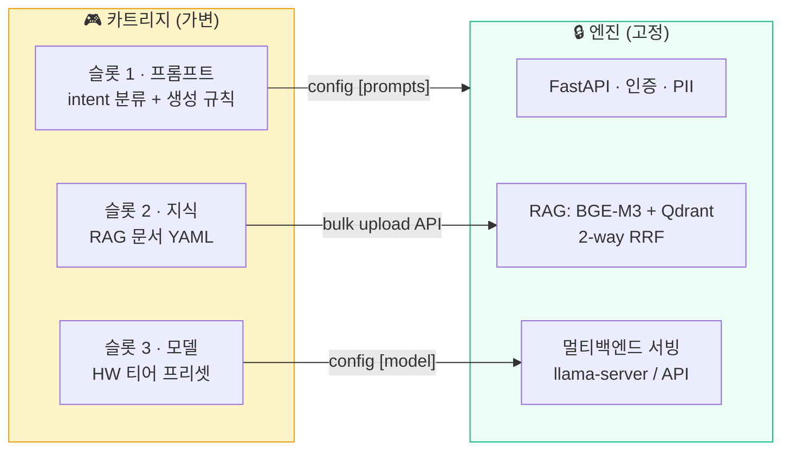
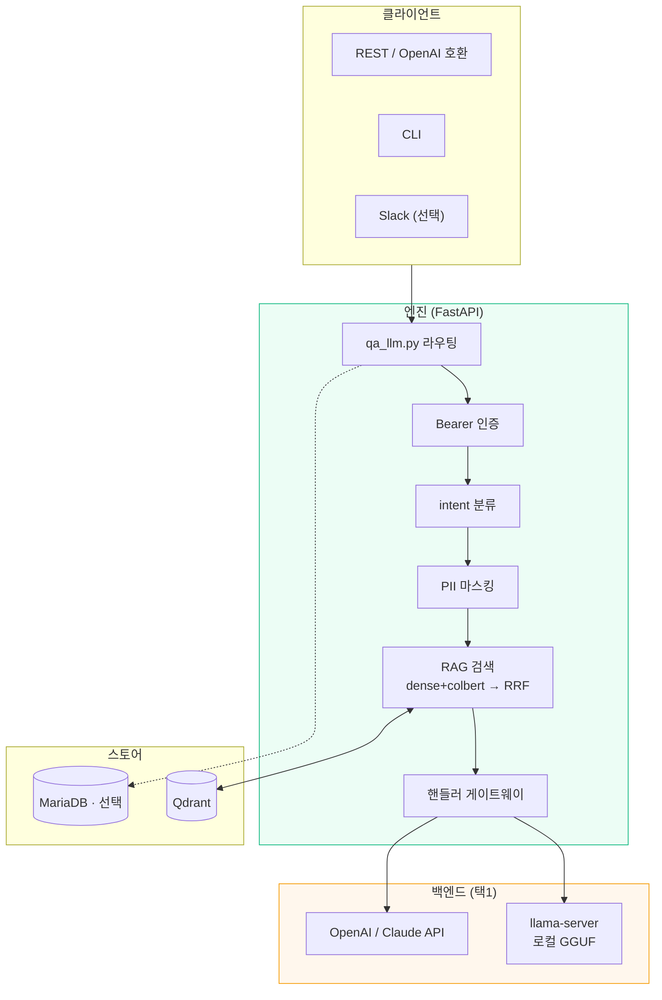
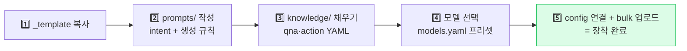

<div align="center">

<!-- Hero Banner -->


<br/>

# 🕹️ ai-console

### 나만의 온프레미스 AI 에이전트 — 엔진은 고정, 도메인은 카트리지

**프로덕션 SecOps 에이전트에서 도메인을 걷어낸 범용 "에이전트 본체(콘솔)".
엔진(RAG · intent · 멀티백엔드 서빙)은 콘솔에 고정하고,
도메인(프롬프트) · 지식(RAG 문서) · 모델(HW 맞춤)은 카트리지로 꽂는다.**

[](https://python.org)
[](https://fastapi.tiangolo.com)
[](https://github.com/ggml-org/llama.cpp)
[](https://qdrant.tech)
[](https://huggingface.co/BAAI/bge-m3)
[](LICENSE)


**[🇺🇸 English README](README.en.md)**

</div>

---

> [!NOTE]
> 프로덕션 SecOps 에이전트에서 **도메인을 걷어낸 범용 본체**입니다.
> 엔진(RAG · intent · 멀티백엔드 서빙)은 콘솔에 고정되어 있고, 도메인을 바꾸려면
> 코드가 아니라 카트리지(프롬프트 · 지식 · 모델)를 교체합니다.

## 📑 목차

<table>
<tr>
<td width="50%">

- [왜 ai-console인가](#왜-ai-console인가)
- [🚀 빠른 시작](#-빠른-시작)
- [🎮 핵심 개념 — 3슬롯 카트리지](#-핵심-개념--3슬롯-카트리지)
- [🏗️ 아키텍처](#️-아키텍처)
- [🖥️ 모델 선택 — 내 HW엔 뭐가 깔리나](#️-모델-선택--내-hw엔-뭐가-깔리나)

</td>
<td width="50%">

- [🧩 나만의 에이전트 만들기](#-나만의-에이전트-만들기)
- [📁 디렉터리 구조](#-디렉터리-구조)
- [🗺️ 프로젝트 상태](#️-프로젝트-상태)
- [📄 문서](#-문서)

</td>
</tr>
</table>

---

## 왜 ai-console인가

- **데이터가 내 기기를 떠나지 않는다.** 모델·벡터DB·임베딩 전부 로컬. 외부 API 백엔드는 선택이다.
- **프레임워크 종속이 없다.** FastAPI + llama.cpp + Qdrant 그대로. LangChain류 오케스트레이션 레이어를 두지 않는다.
- **파인튜닝을 하지 않는다.** 도메인 능력은 순정 가중치 위의 프롬프트 + RAG로만 만든다. 도메인을 갈아끼워도 모델은 그대로다.
- **내 하드웨어에 맞춘다.** GPU 없는 노트북부터 24GB+ GPU까지 프리셋을 제공하고, 설치기가 하드웨어를 보고 골라준다.
- **아키텍처는 실운영에서 왔다.** 이 엔진은 프로덕션에서 돌던 도메인 에이전트에서 도메인을 걷어내 범용화한 것이다.

---

## 🚀 빠른 시작

```bash
git clone https://github.com/adorahelen/ai-console-public.git ai-console && cd ai-console
./install.sh          # HW 감지 → 티어 판정 → 프리셋 선택 → 전부 자동
```

설치기가 하는 일: **HW 감지**(VRAM·램) → **티어 판정** → [models.yaml](models.yaml) 프리셋 제안 → 시스템 의존성 → 파이썬 venv → **llama.cpp 빌드**(릴리스 태그 고정, GPU면 CUDA) → **Qdrant** 바이너리 → 모델 다운로드 → **config.ini 생성** → 다음 단계 안내.

```bash
./install.sh --preset gemma4-12b-q4 --yes # 비대화형
./install.sh --dry-run                    # 계획만 (설치 안 함)
./install.sh --no-model                   # 모델만 나중에
```

설치 후:
```bash
./qdrant/qdrant &                 # 벡터DB
.venv/bin/python qa_llm.py        # 콘솔 기동
# 브라우저 → https://localhost:8443/wizard   ← 온보딩 위저드 (캐릭터 생성·지식 채우기)
# API 문서 → https://localhost:8443/docs
```

> 🧭 **설치가 내 환경에서 정확히 뭘 하는지**(CPU/GPU/API 경로별 단계·빌드·예상 시간): [docs/install-paths.md](docs/install-paths.md)
> 🛠️ **자기만의 에이전트 만들기** 단계별 가이드: [docs/build-your-own-agent.md](docs/build-your-own-agent.md)
> 🧪 **설치·기동·위저드·RAG 종단 검증**: [docs/testing-guide.md](docs/testing-guide.md)

---

## 🎮 핵심 개념 — 3슬롯 카트리지

**엔진은 도메인을 모른다.** 도메인 정체성은 카트리지의 세 슬롯이 전부 결정한다:



| 슬롯 | 교체 통로 (이미 존재하는 메커니즘) | 코드 수정 |
| :-- | :-- | :--: |
| **프롬프트** | `config.ini [prompts]` — 경로 전부 외부화되어 있음 | 불필요 |
| **지식** | `POST /api/ai/prompts/bulk` — YAML 업로드 → 임베딩 → Qdrant 적재 | 불필요 |
| **모델** | `config.ini [model] model=<핸들러>` 한 줄 + [models.yaml](models.yaml) 프리셋 | 불필요 |

> 이 프레임워크가 "새로 짓는 것"이 아닌 이유: 위 세 통로가 **원본 프로덕션 코드에 이미 설계돼 있었다.** 이 리포의 작업은 핸들러 안에 남아 있던 인라인 도메인 문구를 이 통로로 밀어낸 것뿐이다.

---

## 🏗️ 아키텍처

파인튜닝 없이 순정 모델 + RAG + 프롬프트로 도메인 능력을 만드는 구조다.



요청 파이프라인: **질문 → intent 분류 → PII 마스킹 → 2-way RAG 검색+RRF → intent 프롬프트+context 주입 → 스트리밍 응답.**
> PII 마스킹은 **`[pii] pii_mode = True` 일 때만** 동작한다(기본 off). 적용 범위는 핸들러마다 다르다 — 외부 API 티어(openai·claude)와 gemma 는 전 경로, 나머지 로컬 핸들러는 completions2 경로. 표는 [security-review.md](security-review.md) S-6. intent 체계도 카트리지가 정의한다 — `QNA`·`ACTION`·`PLAN`·`PLAYBOOK` 같은 축을 도메인에 맞게 직접 설계하면 된다.

---

## 🖥️ 모델 선택 — 내 HW엔 뭐가 깔리나

`install.sh`가 HW를 보고 자동으로 고른다. 아래가 그 전체 매핑이다.

| # | GPU | `VRAM_GB` | 램 | 티어 | **설치되는 모델** | 근거 |
| :-: | :-- | --: | --: | :-- | :-- | :-- |
| 1 | 없음 | 0 | 4GB | `cpu-only` | — 요건 미달, 안내 후 중단 | — |
| 2 | 없음 | 0 | 8GB | `cpu-only` | `gemma4-e2b-q4` | ⚠️ 미측정 |
| 3 | 없음 | 0 | 16GB | `cpu-only` | `gemma4-e4b-q4` | ⚠️ 미측정 |
| 4 | 없음 | 0 | 32GB | `cpu-only` | `gemma4-e4b-q4` | ⚠️ 미측정 |
| 5 | RTX 4060 8GB | 7 | 16GB | `gpu-8gb` | `gemma4-e4b-q4` | ⚠️ 미측정 |
| 6 | RTX 3060 12GB | 12 | 16GB | `gpu-16gb` | `gemma4-12b-q4` | ✅ 7,836MiB·99.1 tok/s |
| 7 | 5070 Ti 16GB | 15 | 16GB | `gpu-16gb` | `gemma4-12b-q4` | ✅ 동일 |
| 8 | 5070 Ti 16GB | 15 | 32GB | `gpu-16gb` | `gemma4-12b-q4` | ✅ 동일 |
| 9 | RTX 4090 | 23 | 32GB | `gpu-16gb` | `gemma4-12b-q4` | ✅ 동일 |
| 10 | RTX 3090 24GB | 24 | 32GB | `gpu-24gb+` | `gemma4-26b-full` | ✅ 221 tok/s·TTFT 16ms |
| 11 | RTX 5090 32GB | 31 | 64GB | `gpu-24gb+` | `gemma4-26b-full` | ✅ 동일 |
| 12 | (`--tier api`) | — | — | `api` | `openai-api` | HW 무관 |

`VRAM_GB`는 `nvidia-smi` 보고값 ÷ 1024의 **정수 몫**이다. 24GB 카드라도 보고값이 24,576MiB 미만이면 23으로 떨어져 `gpu-16gb`가 된다(9행). `api` 티어는 자동 감지로 도달하지 않는다 — `--tier api`로 명시해야 한다.

**고르는 방식은 2단계다.** ① VRAM으로 티어를 정하고 ② 그 티어 안에서 `min_vram_gb`·`min_ram_gb`를 **둘 다** 넘는 프리셋만 후보로 남긴 뒤 실측 tok/s가 가장 높은 것을 기본값으로 쓴다. VRAM과 램은 대체재가 아니라 AND 조건이다 — 26B MoE 오프로드는 VRAM 14GB **그리고** 램 32GB가 있어야 한다(expert 가중치가 램에 ~14GB 상주). 후보가 0건이면 설치를 강행하지 않고 사유와 우회 경로를 안내하고 멈춘다(1행).

**왜 Gemma로 통일했나** — 티어 기본을 Gemma 4 계열로 맞추면 전 티어가 `runtime=server`가 되어 `llama-cpp-python` 소스 빌드 단계가 사라지고, KV 캐시 재사용(`--cache-reuse`)이 기본으로 붙는다. 이 콘솔은 매 요청마다 긴 시스템 프롬프트 + RAG 컨텍스트를 prefix로 깔기 때문에 그 효과가 큰 구조다.

> ⚠️ **2~5행(`e2b`/`e4b`)은 런타임 실측이 없다.** 파일 크기(2.62GB·4.22GB)만 확인했고 메모리·tok/s·응답 품질은 측정 전이다. `min_ram_gb` 8·12는 보수적 추정치다. 저사양에서 처음 쓴다면 이 점을 감안하고, 실제 수치가 나오면 이슈로 남겨주면 좋겠다.

`gpt-oss-20b`(13.2GB·176 tok/s)와 `llama31-8b-q4`(7.9GB)는 삭제된 게 아니라 **`--preset` 지정 전용**으로 내려갔다. 실측 자산이 가장 두터운 둘이라 수치는 [models.yaml](models.yaml)에 그대로 있다.

```bash
./install.sh --preset gpt-oss-20b     # 16GB에서 생성 속도가 가장 빠른 선택지
./install.sh --tier api               # GPU 없이 외부 API로
```

> 임베딩(BGE-M3)은 전 티어 공통이며 VRAM을 약 1.0GB 더 쓴다([multi-instance.md](docs/multi-instance.md) 실측). 위 표의 요건에는 이 몫이 포함돼 있다.

---

## 🧩 나만의 에이전트 만들기

두 가지 길:

**길 A — 위저드 (파일 안 만짐).** 설치 후 `https://localhost:8443/wizard` 접속 → 에이전트 캐릭터 서술 → 지식 붙여넣기 → **설치된 LLM이 내부 포맷 변환을 대신한다** (자기부트스트랩) → 카트리지 저장 → 기동.

**길 B — 카트리지 수제작:**



1. `cartridges/_template/` 복사 → [cartridge.yaml](cartridges/_template/cartridge.yaml) 메타 작성
2. `prompts/` — intent 분류 + intent별 시스템 프롬프트 (도메인 지능의 본체)
3. `knowledge/` — RAG 문서. 형식은 [knowledge/README.md](cartridges/_template/knowledge/README.md) (`qna`/`action` 2종)
4. `models.yaml`에서 HW에 맞는 프리셋 선택
5. `config.ini [prompts]` 경로 연결 + `POST /api/ai/prompts/bulk`로 지식 업로드

명령어·스모크 테스트까지 포함한 전체 안내: **[docs/build-your-own-agent.md](docs/build-your-own-agent.md)**
살아있는 예시가 기본 탑재돼 있다: **[cartridges/console-guide/](cartridges/console-guide/)** — 콘솔 자신의 사용법을 카트리지로 포장한 실물.

### 여러 포맷을 한꺼번에 — `ingest.py`

디렉터리 안 문서를 한 번에 지식 카트리지로 굽는 배치 인제스터. **콘솔이 먹는 포맷은 Q&A YAML 하나**뿐이고, 포맷 다양성은 입력단에서 흡수한다.

```bash
python ingest.py <소스_디렉터리> <카트리지_이름>   # 추출 → 변환 → validate → cartridges/<이름>/
```

- **텍스트 계열**(csv·json·xml·md·txt)은 바로. **PDF·DOCX·XLSX·이미지(OCR)**는 추출 라이브러리 설치 시 처리(미설치면 그 파일만 건너뛰고 안내).
- **구조화 소스**(`question`·`answer` 열이 있는 csv/json/xlsx)는 결정적 직접 매핑(무손실). **비정형 문서**는 설치된 로컬 LLM(`/api/wizard/knowledge-convert`)이 Q&A 초안 생성 → **검수 권장**(초안이지 완성이 아니며, validate는 stub만 거르고 정답 여부는 검증 못 함).
- 끝에 `cartridge validate`로 걸러 `aibotctl cartridge mount`. **새 메커니즘 아님** — `/knowledge-convert` + `validate`를 배치로 감싼 얇은 층이다. 콘솔 기동 + `api_keys/default.key` 필요.

장착은 **런타임에 반영된다** — `aibotctl cartridge mount`(또는 위저드)가 끝나면 콘솔 재시작 없이 새 프롬프트·지식이 물린다. 반영이 확인 안 되면 `./run.sh restart`가 폴백이다.

---

## 📁 디렉터리 구조

```
ai-console/
│
│  ── 🧠 엔진 코어 (루트 평면 py 약 30개 — 도메인 언급 0건) ──
├── qa_llm.py                    # 메인 — FastAPI 서버·전체 API 엔드포인트
├── handler_base.py              # 핸들러 공통 베이스
├── handler_{llama,gemma,gpt_oss,openai,claude,qwen}.py   # 모델별 핸들러 6종
├── handler_registry.py          # 모델명→핸들러 매핑
├── aibot_llm_module.py          # 핸들러 로드·라우팅
├── aibot_rag_module_BGE{,_2way_rrf}.py   # RAG 코어 (BGE-M3 + Qdrant 2-way RRF)
├── aibot_intent_analyzer.py     # intent 분류 (카트리지 프롬프트 구동)
├── aibot_wizard.py              # 온보딩 위저드 API
├── aibot_{PII,restapi_auth,validation,logger,...}.py     # 부속 모듈
│
│  ── 📦 도메인 슬롯 ──
├── cartridges/
│   ├── _template/               # 새 도메인 시작점 (3슬롯 매니페스트)
│   └── console-guide/           # 예시 카트리지 — 콘솔 자신의 사용법 안내
├── cartridge_{mount,validate}.py   # 장착·해제 배선 / 스키마·stub 검증
├── ingest.py                    # 문서 디렉터리 → 지식 카트리지 배치 인제스터
├── prompts/                     # 본체 기본 프롬프트 (카트리지가 [prompts] 경로로 교체)
│
│  ── 🚀 설치·운영 ──
├── install.sh                   # 원샷 설치기 (HW감지→티어→프리셋→빌드→config)
├── models.yaml                  # ★ HW 티어별 모델 프리셋 단일 소스
├── config.ini.template          # 전 설정 원형 (install.sh가 config.ini 생성)
├── run.sh · aibotctl · ai-agent.service
├── docker/                      # 도커 배포 일체 (compose·Dockerfile)
│
│  ── 🖥 UI·문서 ──
├── webui/wizard.html            # 온보딩 위저드 SPA
└── docs/                        # 설치 경로·테스트 가이드·설계 노트
```

---

## 🗺️ 프로젝트 상태

**pre-release.** 엔진·설치기·위저드·카트리지 CLI는 모두 구현돼 동작하지만, **깨끗한 환경에서의 설치 종단 검증이 아직 남아 있다.** 처음 써 본다면 그 점을 감안하고, 막히는 지점은 이슈로 남겨주면 좋겠다.

| 영역 | 상태 |
| :-- | :-- |
| 엔진 (RAG · intent · 핸들러 게이트웨이) | 동작 |
| `install.sh` — HW 감지·빌드·systemd 등록 | 동작 (`--dry-run` 으로 미리 볼 수 있다) |
| 웹 온보딩 위저드 · 채팅 UI | 동작 |
| 카트리지 CLI (validate·mount·unmount·purge) | 동작 |
| 깨끗한 환경 설치 종단 검증 | **미완** |
| 다중 GPU 분리 배정 | 미검증 |

보안 점검 내역과 알려진 한계는 [security-review.md](security-review.md)에 있다. 특히 **콘솔은 기본적으로 `0.0.0.0`에 바인드되고 Qdrant는 인증 없이 뜬다** — 신뢰할 수 없는 망에 두지 말고 방화벽으로 포트를 막아라.

---

## 📄 문서

| 문서 | 내용 |
| :-- | :-- |
| [docs/install-paths.md](docs/install-paths.md) | 설치기가 CPU/GPU/API 경로별로 정확히 무엇을 하는지, 예상 소요 |
| [docs/build-your-own-agent.md](docs/build-your-own-agent.md) | 카트리지 제작 전 과정 (위저드 · 수제작 두 경로) |
| [docs/api-integration.md](docs/api-integration.md) | 외부 제품에서 REST로 붙이는 연동 계약 |
| [docs/multi-instance.md](docs/multi-instance.md) | 한 호스트에 콘솔 여러 대 — 포트·Qdrant·VRAM 예산 |
| [docs/testing-guide.md](docs/testing-guide.md) | 설치→기동→위저드→RAG 종단 검증 절차 |
| [docs/onboarding-design.md](docs/onboarding-design.md) | 위저드 UX 설계 배경 |
| [security-review.md](security-review.md) | 보안 점검 내역과 알려진 한계 |
| [architecture.md](architecture.md) · [api-reference.md](api-reference.md) · [requirements.md](requirements.md) | 설계 · 인터페이스 · 요구사항 |

모든 `docs/` 문서는 영문판(`*.en.md`)이 함께 있다.

---

## 🤝 기여

무엇을 받고 무엇을 받지 않는지, PR 전에 돌릴 검사까지 **[CONTRIBUTING.md](CONTRIBUTING.md)** 에 정리돼 있다. 버그·제안은 [이슈](https://github.com/adorahelen/ai-console-public/issues)로 열어주면 된다.

---

## 📄 라이선스

[MIT](LICENSE)

<div align="center">

**엔진은 고정, 도메인은 카트리지.**

</div>
