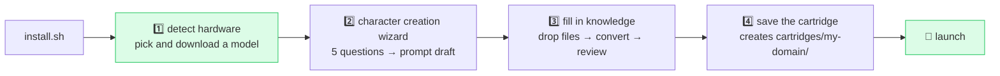

# Onboarding design — how a user fills a cartridge

> 🇰🇷 Korean original: [onboarding-design.md](onboarding-design.md)
>
> The UX design document behind Phase 2 (install.sh) and Phase 3 (web UI). Settled 2026-07-21.
> Related: the roadmap in [DEVELOPMENT.md](../DEVELOPMENT.md) · [cartridges/_template/](../cartridges/_template/)

## Design principle

**Never ask the user for internal formats (YAML, intent prompts) directly.
Converting raw material into the internal formats is the job of the LLM they just installed.**

The moment the model download finishes, the console has a local LLM sitting there ready to work.
We reuse it as the onboarding tool — **the console bootstraps itself.**

## The whole onboarding flow



Step 4 is the point of it all: the wizard's output is saved as a `cartridge.yaml + prompts/ + knowledge/` directory.
**What the user made is itself a distributable, shareable cartridge** — the wizard is a cartridge editor.

---

## Slot A: RAG knowledge — three input paths, two conversion modes

### Input paths (easiest first)

| Path | For | Behavior |
|---|---|---|
| **① Drop files** | most people | Drag and drop PDF/MD/DOCX/TXT → automatic conversion and embedding |
| **② Fill in a form** | people who want to shape the Q&A themselves | "question/answer" cards in the web UI → qna YAML generated behind the scenes |
| **③ Write YAML** | power users and cartridge authors | Author to the `_template` spec → bulk upload (the pre-existing path) |

### Conversion modes (what ① does internally — both are supported)

| Mode | Behavior | Effort | Quality |
|---|---|:--:|:--:|
| **Document mode (chunking)** | Split the document and embed it as-is | none | fair |
| **Curation mode (LLM conversion)** | The local LLM reads the document and drafts qna YAML ("N likely questions + answers + aliases") → the user reviews → it is stored | review only | high |

- The strength of the original SecOps corpus was exactly this curation quality (the question/answer/aliases structure).
  Automating it is what sets this product apart.
- ⚠️ **Where the engine needs work**: the RAG payload currently accepts only qna/action units.
  Adding a **chunk-type payload** for document mode is the single RAG-core change required.

---

## Slot B: prompts — the "character creation" wizard

The game-console metaphor, taken literally: start a new game → the character creation screen.
The user does not *write* a prompt; they **shape a character by answering questions**:

```
1. What does this agent do?            → role definition (one sentence)
2. Who uses it?                        → audience and expertise level
3. In what tone?                       → formal / terse / detailed (click an option)
4. What rules must it always follow?   → prohibitions, output format
5. [advanced] Does it need to generate work products?  → yes → enables the ACTION intent
```

- The answers go to the **local LLM, which drafts a system prompt** (meta-prompting)
  → **a test conversation** in the preview → edits → save (wired into `config [prompts]`).
- **Start with a single intent (QNA).** Most goals are "a chatbot that answers from my documents", where intent classification is overkill. ACTION and PLAN open up only if question 5 is a yes — **progressive disclosure**.
- **A gallery alongside it** (to kill blank-page fear): start from a preset cartridge — `document Q&A`, `customer support`, `coding assistant` — and edit from there.

---

## What the engine actually needed — implementation status (2026-07-21)

| # | Change | Status |
|:--:|---|---|
| 1 | Chunk-type payload (document mode) | ⏸️ **On hold** — RAG-core changes wait for an environment where they can be verified at runtime. Curation mode covers document input for now |
| 2 | Two meta-prompts for document → qna conversion | ✅ `prompts/system/wizard_prompt_draft.txt` · `wizard_knowledge_extract.txt` (wired through `[prompts]` keys) |
| 3 | Wizard API | ✅ `aibot_wizard.py` — prompt-draft, test-chat, knowledge-convert, cartridge-save. The UI is `webui/wizard.html` (a single page served at `/wizard`). cartridge-save is verified end-to-end via TestClient |

## Still undecided (to be judged at implementation time)

- Chunking strategy: fixed length vs. structure-aware (markdown header boundaries) — decide after measuring both
- Default number of questions generated in curation mode (proportional to document length?)
- Wizard localization: the first release ships Korean and English meta-prompts
- Which PDF parsing library to use (and how well it needs to handle tables and images)
